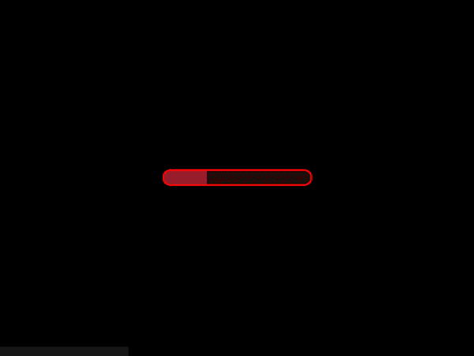

# Hell Pong Multiplayer Game


[](https://github.com/Dsazz/hell-pong-game/actions/workflows/ci.yml)
[](https://wakatime.com/badge/user/dc758638-7ecf-4653-9e0b-0f51eec4bb35/project/92bc3a12-6df4-4d7e-aa72-3e33575d61e5)

Welcome to Hell Pong, a fast-paced multiplayer ping-pong game built with Lerna, TypeScript, Phaser 3, Matter.js, and Socket.io

<div align="center">
  
</div>

## Table of Contents

- [Demo](#demo)
- [Features](#features)
- [Getting Started](#getting-started)
- [Prerequisites](#prerequisites)
- [Acknowledgments](#acknowledgments)
- [Installation](#installation)
- [Running the Game](#running-the-game)
- [Deployment](#deployment)
- [Contributing](#contributing)

## Demo

You can try to play the game on this [link](https://hell-pong.herokuapp.com)

<div align="center">
  
</div>

## Features

- Real-time multiplayer gameplay
- Smooth and responsive controls
- Physics-based ball and paddle movements using Matter.js
- Customizable game settings
- Interactive lobby system
- Cross-platform compatibility

## Getting Started

These instructions will guide you through setting up the project on your local machine for development and testing purposes.

### Prerequisites

Before starting, make sure you have the following software installed on your system:

- [Node.js](https://nodejs.org/en/download/) (v14.x or later)
- [Yarn](https://yarnpkg.com/) (v1.x or later)
- [Git](https://git-scm.com/downloads) (Optional, if you want to clone the repository)
- [Lerna](https://lerna.js.org/) (v6.5.1 or later)

## Acknowledgments

- [Phaser 3](https://phaser.io/) - A powerful game framework used for building the game
- [Matter.js](https://brm.io/matter-js/) - A 2D physics engine for the web used in the game
- [Socket.IO](https://socket.io/) - A real-time bidirectional event-based communication library
- [Lerna](https://lerna.js.org/) - A tool for managing JavaScript projects with multiple packages
- [TypeScript](https://www.typescriptlang.org/) - A typed superset of JavaScript that adds optional static types

### Installation

1. Clone the repository or download the project files:
```
git clone git@github.com:Dsazz/hell-pong-game.git
```
2. Navigate to the project folder:
```
cd hell-pong-game
```
3. Install the required dependencies and bootstrap the Lerna packages:
```
yarn && yarn lerna bootstrap
```

## Running the Game

To start the development server for both client and server, run:
```
yarn start
```
> Important for Apple M-series: 
arch -arm64 brew install pkg-config cairo pango libpng jpeg giflib librsvg


This will start the client and server concurrently, accessible at [http://localhost:8000](http://localhost:8000). Open 
the URL in your browser to start playing the game.

You can also run the client and server separately with the following commands:
```
yarn start:client
yarn start:server
```

## Deployment

To deploy the game on a production server, follow these steps:

1. Build the production bundle:
```
yarn build
```

This will create optimized production builds for both the client and server packages.

2. Set up a web server of your choice (e.g., [Nginx](https://nginx.org/en/), [Apache](https://httpd.apache.org/), or [Node.js](https://nodejs.org/en/about/)) to serve the client files from the `packages/client/dist` directory.

3. Configure the server to serve the game over HTTPS, as the game uses WebSockets for real-time communication, and most modern browsers require a secure connection for WebSockets.

4. Set up a process manager like [PM2](https://pm2.keymetrics.io/) to run the server package. Navigate to the `packages/server` directory and run the following command:
```
pm2 start dist/index.js --name hell-pong-server
```
This will start the server using PM2 and keep it running in the background.

5. Update the client configuration to point to the production server's WebSocket URL. This can be found in the 
packages/client/src/config.ts file. Change the serverUrl to match your server's domain or IP address.

6. Restart the client and server processes to apply the changes.

Now your game should be live and accessible on your production server!

## Contributing

We welcome contributions from the community! If you'd like to contribute to Hell Pong, please follow these steps:

1. Fork the repository
2. Create a new branch with a descriptive name (e.g., `feature/new-game-mode`)
3. Commit your changes to the new branch
4. Open a pull request against the `main` branch, describing your changes and any relevant context

For more detailed information on contributing, please read the [CONTRIBUTING.md](CONTRIBUTING.md) file.
